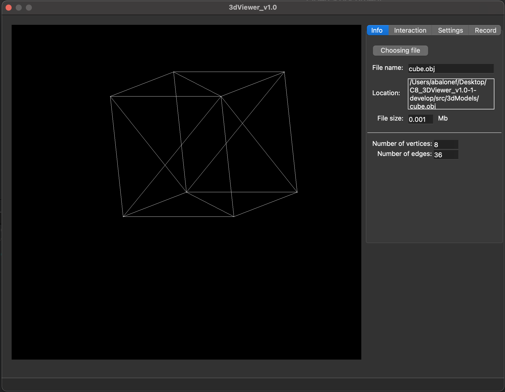
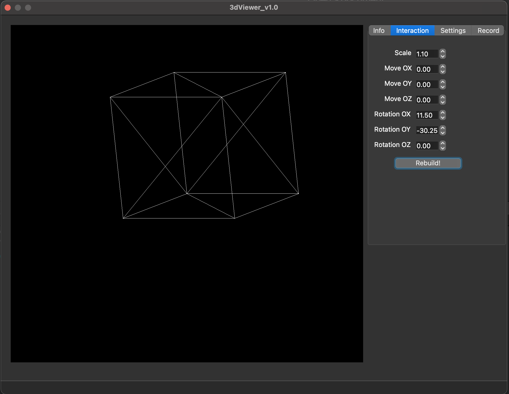
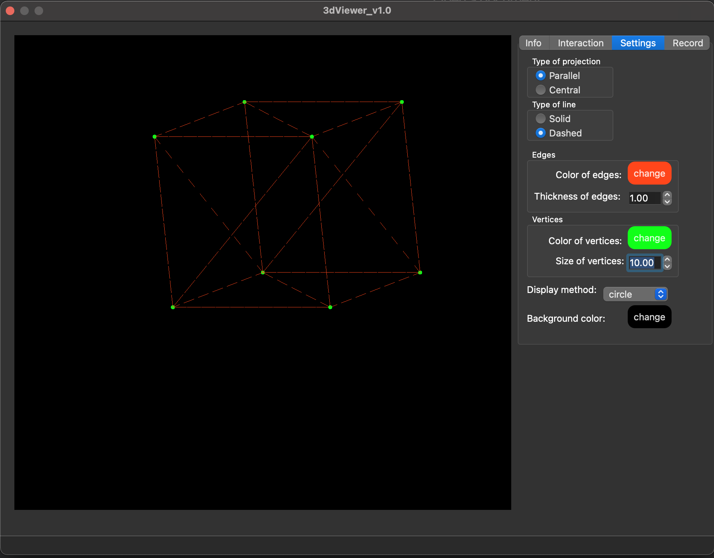

# 3DViewer v1.0

Project date: 05-2023  

Групповой проект, под моей ответственностью было
Реализация программы 3DViewer v1.0 для просмотра 3D моделей в каркасном виде. Сами модели необходимо загружать из файлов формата .obj. Имеется возможность просматривать их на экране с возможностью вращения, масштабирования и перемещения.
Версия QT: 6.2.3

## Project Build

Сборка проекта осуществляется командой `make` в папке `src`, существуют следующие цели:  
- `install` - установка приложения в папку build,  
- `uninstall` - деинсталляция,  
- `dvi` - открытие справки,  
- `dist` - архивирование проекта,  
- `gcov_report` - просмотр покрытия тестов (необходима утилита lcov),  
- `style` - приведение кода к стилю clang-format,  
- `check_style` - проверка кода на стиль,  
- `valgrind` - проверка на утечки утилитой valgrind,  
- `leaks` - проверка на утечки утилитой leaks на Mac OS,  
- `rebuild` - пересобрать проект,  
- `clean` - очистить проект от временных файлов.

## Описание

- Программа разработана на языке Си стандарта C11 с использованием компилятора gcc.
- Код программы находится в папке src 
- Сборка программы должна быть настроена с помощью Makefile со стандартным набором целей для GNU-программ: all, install, uninstall, clean, dvi, dist, tests, gcov_report.
- Программа разработана в соответствии с принципами структурного программирования
- Обеспечено покрытие unit-тестами модулей, связанных с загрузкой моделей и аффинными преобразованиями
- В один момент времени может быть только одна модель на экране.
- Программа предоставляет возможность:
    - Загружать каркасную модель из файла формата obj (поддержка только списка вершин и поверхностей).
    - Перемещать модель на заданное расстояние относительно осей X, Y, Z.
    - Поворачивать модель на заданный угол относительно своих осей X, Y, Z
    - Масштабировать модель на заданное значение.
- В программе реализован графический пользовательский интерфейс, на базе QT
- Программа позволяет настраивать тип проекции (параллельная и центральная)
- Программа позволяеть настраивать тип (сплошная, пунктирная), цвет и толщину ребер, способ отображения (отсутствует, круг, квадрат), цвет и размер вершин
- Программа позволяет выбирать цвет фона
- Настройки сохраняются между перезапусками программы
 - Программа позволяет сохранять полученные ("отрендеренные") изображения в файл в форматах bmp и jpeg
 - Программа позволяет по специальной кнопке записывать небольшие "скринкасты" - текущие пользовательские аффинные преобразования загруженного объекта в gif-анимацию (640x480, 10fps, 5s)

 ## Скриншоты

   
   
   
   
